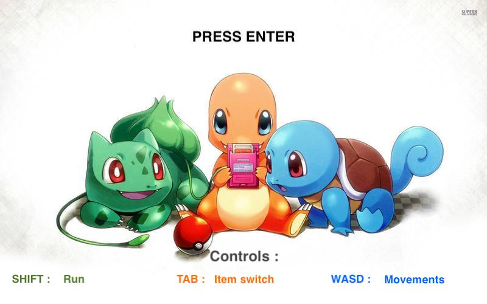

# cub3D

CUB3D is a project from 42 School Paris, a development school in Paris.

# PokeCub3D
I added some bonus in my cub3d project that transforms the game into a POKEMON game !
The goal is to capture the 2 legendaries Pokemon hidden in the game. You also have to evolve all 3 Cyndaquil into Typhlosion to finish the game !
All the controls are written on the home screen, so have a good look ! ;)

# How to get the code
First run the command in your terminal :

```git clone https://github.com/Sheschire/cub3D.git  ```

Then go in the cub3D folder and run ```make```.

It will compile the project into one exec file.

If you want to play PokeCub3D, run :

```./cub3D map/poke.cub```

ENJOY !

PS : You will prefer play on MacOs because I put some sounds in the game. However playing on Linux will be enjoyable, sounds are missing.
PLEASE play on mac !


